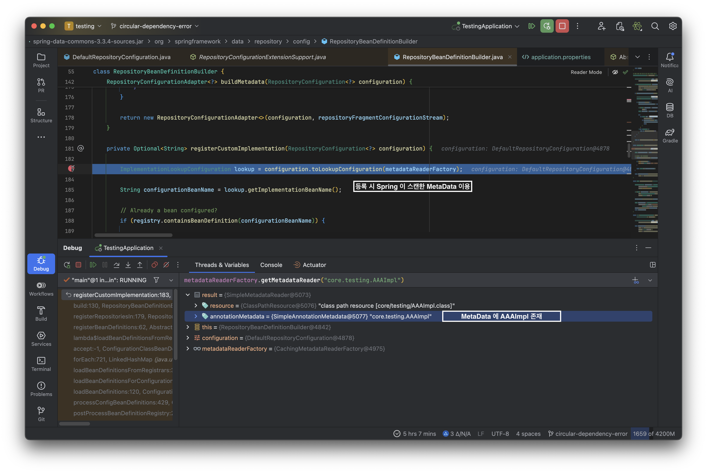

# A Possible Bug in `Spring Data JPA`?

- Major Dependencies

|                    `lib`                     |  `ver`   |
|:--------------------------------------------:|:--------:|
|  `org.springframework.data:spring-data-jpa`  | `3.3.4`  |
|      `org.springframework:spring-core`       | `6.1.13` |
| `org.springframework.boot:spring-boot:3.3.4` | `3.3.4`  |


<details><summary> All gradle dependencies</summary>

```bash
# on project root dir
$ ./gradlew dependencies
```
```markdown
14:53:35: Executing 'dependencies'...


> Task :dependencies

------------------------------------------------------------
Root project 'testing'
------------------------------------------------------------

annotationProcessor - Annotation processors and their dependencies for source set 'main'.
No dependencies

bootArchives - Configuration for Spring Boot archive artifacts. (n)
No dependencies

compileClasspath - Compile classpath for source set 'main'.
\--- org.springframework.boot:spring-boot-starter-data-jpa -> 3.3.4
     +--- org.springframework.boot:spring-boot-starter-aop:3.3.4
     |    +--- org.springframework.boot:spring-boot-starter:3.3.4
     |    |    +--- org.springframework.boot:spring-boot:3.3.4
     |    |    |    +--- org.springframework:spring-core:6.1.13
     |    |    |    |    \--- org.springframework:spring-jcl:6.1.13
     |    |    |    \--- org.springframework:spring-context:6.1.13
     |    |    |         +--- org.springframework:spring-aop:6.1.13
     |    |    |         |    +--- org.springframework:spring-beans:6.1.13
     |    |    |         |    |    \--- org.springframework:spring-core:6.1.13 (*)
     |    |    |         |    \--- org.springframework:spring-core:6.1.13 (*)
     |    |    |         +--- org.springframework:spring-beans:6.1.13 (*)
     |    |    |         +--- org.springframework:spring-core:6.1.13 (*)
     |    |    |         +--- org.springframework:spring-expression:6.1.13
     |    |    |         |    \--- org.springframework:spring-core:6.1.13 (*)
     |    |    |         \--- io.micrometer:micrometer-observation:1.12.10 -> 1.13.4
     |    |    |              \--- io.micrometer:micrometer-commons:1.13.4
     |    |    +--- org.springframework.boot:spring-boot-autoconfigure:3.3.4
     |    |    |    \--- org.springframework.boot:spring-boot:3.3.4 (*)
     |    |    +--- org.springframework.boot:spring-boot-starter-logging:3.3.4
     |    |    |    +--- ch.qos.logback:logback-classic:1.5.8
     |    |    |    |    +--- ch.qos.logback:logback-core:1.5.8
     |    |    |    |    \--- org.slf4j:slf4j-api:2.0.15 -> 2.0.16
     |    |    |    +--- org.apache.logging.log4j:log4j-to-slf4j:2.23.1
     |    |    |    |    +--- org.apache.logging.log4j:log4j-api:2.23.1
     |    |    |    |    \--- org.slf4j:slf4j-api:2.0.9 -> 2.0.16
     |    |    |    \--- org.slf4j:jul-to-slf4j:2.0.16
     |    |    |         \--- org.slf4j:slf4j-api:2.0.16
     |    |    +--- jakarta.annotation:jakarta.annotation-api:2.1.1
     |    |    +--- org.springframework:spring-core:6.1.13 (*)
     |    |    \--- org.yaml:snakeyaml:2.2
     |    +--- org.springframework:spring-aop:6.1.13 (*)
     |    \--- org.aspectj:aspectjweaver:1.9.22.1
     +--- org.springframework.boot:spring-boot-starter-jdbc:3.3.4
     |    +--- org.springframework.boot:spring-boot-starter:3.3.4 (*)
     |    +--- com.zaxxer:HikariCP:5.1.0
     |    |    \--- org.slf4j:slf4j-api:1.7.36 -> 2.0.16
     |    \--- org.springframework:spring-jdbc:6.1.13
     |         +--- org.springframework:spring-beans:6.1.13 (*)
     |         +--- org.springframework:spring-core:6.1.13 (*)
     |         \--- org.springframework:spring-tx:6.1.13
     |              +--- org.springframework:spring-beans:6.1.13 (*)
     |              \--- org.springframework:spring-core:6.1.13 (*)
     +--- org.hibernate.orm:hibernate-core:6.5.3.Final
     |    +--- jakarta.persistence:jakarta.persistence-api:3.1.0
     |    \--- jakarta.transaction:jakarta.transaction-api:2.0.1
     +--- org.springframework.data:spring-data-jpa:3.3.4
     |    +--- org.springframework.data:spring-data-commons:3.3.4
     |    |    +--- org.springframework:spring-core:6.1.13 (*)
     |    |    +--- org.springframework:spring-beans:6.1.13 (*)
     |    |    \--- org.slf4j:slf4j-api:2.0.2 -> 2.0.16
     |    +--- org.springframework:spring-orm:6.1.13
     |    |    +--- org.springframework:spring-beans:6.1.13 (*)
     |    |    +--- org.springframework:spring-core:6.1.13 (*)
     |    |    +--- org.springframework:spring-jdbc:6.1.13 (*)
     |    |    \--- org.springframework:spring-tx:6.1.13 (*)
     |    +--- org.springframework:spring-context:6.1.13 (*)
     |    +--- org.springframework:spring-aop:6.1.13 (*)
     |    +--- org.springframework:spring-tx:6.1.13 (*)
     |    +--- org.springframework:spring-beans:6.1.13 (*)
     |    +--- org.springframework:spring-core:6.1.13 (*)
     |    +--- org.antlr:antlr4-runtime:4.13.0
     |    +--- jakarta.annotation:jakarta.annotation-api:2.0.0 -> 2.1.1
     |    \--- org.slf4j:slf4j-api:2.0.2 -> 2.0.16
     \--- org.springframework:spring-aspects:6.1.13
          \--- org.aspectj:aspectjweaver:1.9.22.1

compileOnly - Compile-only dependencies for the 'main' feature. (n)
No dependencies

default - Configuration for default artifacts. (n)
No dependencies

developmentOnly - Configuration for development-only dependencies such as Spring Boot's DevTools.
No dependencies

implementation - Implementation dependencies for the 'main' feature. (n)
\--- org.springframework.boot:spring-boot-starter-data-jpa (n)

mainSourceElements - List of source directories contained in the Main SourceSet. (n)
No dependencies

productionRuntimeClasspath
+--- org.springframework.boot:spring-boot-starter-data-jpa -> 3.3.4
|    +--- org.springframework.boot:spring-boot-starter-aop:3.3.4
|    |    +--- org.springframework.boot:spring-boot-starter:3.3.4
|    |    |    +--- org.springframework.boot:spring-boot:3.3.4
|    |    |    |    +--- org.springframework:spring-core:6.1.13
|    |    |    |    |    \--- org.springframework:spring-jcl:6.1.13
|    |    |    |    \--- org.springframework:spring-context:6.1.13
|    |    |    |         +--- org.springframework:spring-aop:6.1.13
|    |    |    |         |    +--- org.springframework:spring-beans:6.1.13
|    |    |    |         |    |    \--- org.springframework:spring-core:6.1.13 (*)
|    |    |    |         |    \--- org.springframework:spring-core:6.1.13 (*)
|    |    |    |         +--- org.springframework:spring-beans:6.1.13 (*)
|    |    |    |         +--- org.springframework:spring-core:6.1.13 (*)
|    |    |    |         +--- org.springframework:spring-expression:6.1.13
|    |    |    |         |    \--- org.springframework:spring-core:6.1.13 (*)
|    |    |    |         \--- io.micrometer:micrometer-observation:1.12.10 -> 1.13.4
|    |    |    |              \--- io.micrometer:micrometer-commons:1.13.4
|    |    |    +--- org.springframework.boot:spring-boot-autoconfigure:3.3.4
|    |    |    |    \--- org.springframework.boot:spring-boot:3.3.4 (*)
|    |    |    +--- org.springframework.boot:spring-boot-starter-logging:3.3.4
|    |    |    |    +--- ch.qos.logback:logback-classic:1.5.8
|    |    |    |    |    +--- ch.qos.logback:logback-core:1.5.8
|    |    |    |    |    \--- org.slf4j:slf4j-api:2.0.15 -> 2.0.16
|    |    |    |    +--- org.apache.logging.log4j:log4j-to-slf4j:2.23.1
|    |    |    |    |    +--- org.apache.logging.log4j:log4j-api:2.23.1
|    |    |    |    |    \--- org.slf4j:slf4j-api:2.0.9 -> 2.0.16
|    |    |    |    \--- org.slf4j:jul-to-slf4j:2.0.16
|    |    |    |         \--- org.slf4j:slf4j-api:2.0.16
|    |    |    +--- jakarta.annotation:jakarta.annotation-api:2.1.1
|    |    |    +--- org.springframework:spring-core:6.1.13 (*)
|    |    |    \--- org.yaml:snakeyaml:2.2
|    |    +--- org.springframework:spring-aop:6.1.13 (*)
|    |    \--- org.aspectj:aspectjweaver:1.9.22.1
|    +--- org.springframework.boot:spring-boot-starter-jdbc:3.3.4
|    |    +--- org.springframework.boot:spring-boot-starter:3.3.4 (*)
|    |    +--- com.zaxxer:HikariCP:5.1.0
|    |    |    \--- org.slf4j:slf4j-api:1.7.36 -> 2.0.16
|    |    \--- org.springframework:spring-jdbc:6.1.13
|    |         +--- org.springframework:spring-beans:6.1.13 (*)
|    |         +--- org.springframework:spring-core:6.1.13 (*)
|    |         \--- org.springframework:spring-tx:6.1.13
|    |              +--- org.springframework:spring-beans:6.1.13 (*)
|    |              \--- org.springframework:spring-core:6.1.13 (*)
|    +--- org.hibernate.orm:hibernate-core:6.5.3.Final
|    |    +--- jakarta.persistence:jakarta.persistence-api:3.1.0
|    |    +--- jakarta.transaction:jakarta.transaction-api:2.0.1
|    |    +--- org.jboss.logging:jboss-logging:3.5.0.Final -> 3.5.3.Final
|    |    +--- org.hibernate.common:hibernate-commons-annotations:6.0.6.Final
|    |    +--- io.smallrye:jandex:3.1.2
|    |    +--- com.fasterxml:classmate:1.5.1 -> 1.7.0
|    |    +--- net.bytebuddy:byte-buddy:1.14.15 -> 1.14.19
|    |    +--- jakarta.xml.bind:jakarta.xml.bind-api:4.0.0 -> 4.0.2
|    |    |    \--- jakarta.activation:jakarta.activation-api:2.1.3
|    |    +--- org.glassfish.jaxb:jaxb-runtime:4.0.2 -> 4.0.5
|    |    |    \--- org.glassfish.jaxb:jaxb-core:4.0.5
|    |    |         +--- jakarta.xml.bind:jakarta.xml.bind-api:4.0.2 (*)
|    |    |         +--- jakarta.activation:jakarta.activation-api:2.1.3
|    |    |         +--- org.eclipse.angus:angus-activation:2.0.2
|    |    |         |    \--- jakarta.activation:jakarta.activation-api:2.1.3
|    |    |         +--- org.glassfish.jaxb:txw2:4.0.5
|    |    |         \--- com.sun.istack:istack-commons-runtime:4.1.2
|    |    +--- jakarta.inject:jakarta.inject-api:2.0.1
|    |    \--- org.antlr:antlr4-runtime:4.13.0
|    +--- org.springframework.data:spring-data-jpa:3.3.4
|    |    +--- org.springframework.data:spring-data-commons:3.3.4
|    |    |    +--- org.springframework:spring-core:6.1.13 (*)
|    |    |    +--- org.springframework:spring-beans:6.1.13 (*)
|    |    |    \--- org.slf4j:slf4j-api:2.0.2 -> 2.0.16
|    |    +--- org.springframework:spring-orm:6.1.13
|    |    |    +--- org.springframework:spring-beans:6.1.13 (*)
|    |    |    +--- org.springframework:spring-core:6.1.13 (*)
|    |    |    +--- org.springframework:spring-jdbc:6.1.13 (*)
|    |    |    \--- org.springframework:spring-tx:6.1.13 (*)
|    |    +--- org.springframework:spring-context:6.1.13 (*)
|    |    +--- org.springframework:spring-aop:6.1.13 (*)
|    |    +--- org.springframework:spring-tx:6.1.13 (*)
|    |    +--- org.springframework:spring-beans:6.1.13 (*)
|    |    +--- org.springframework:spring-core:6.1.13 (*)
|    |    +--- org.antlr:antlr4-runtime:4.13.0
|    |    +--- jakarta.annotation:jakarta.annotation-api:2.0.0 -> 2.1.1
|    |    \--- org.slf4j:slf4j-api:2.0.2 -> 2.0.16
|    \--- org.springframework:spring-aspects:6.1.13
|         \--- org.aspectj:aspectjweaver:1.9.22.1
\--- com.mysql:mysql-connector-j -> 8.3.0

runtimeClasspath - Runtime classpath of source set 'main'.
+--- org.springframework.boot:spring-boot-starter-data-jpa -> 3.3.4
|    +--- org.springframework.boot:spring-boot-starter-aop:3.3.4
|    |    +--- org.springframework.boot:spring-boot-starter:3.3.4
|    |    |    +--- org.springframework.boot:spring-boot:3.3.4
|    |    |    |    +--- org.springframework:spring-core:6.1.13
|    |    |    |    |    \--- org.springframework:spring-jcl:6.1.13
|    |    |    |    \--- org.springframework:spring-context:6.1.13
|    |    |    |         +--- org.springframework:spring-aop:6.1.13
|    |    |    |         |    +--- org.springframework:spring-beans:6.1.13
|    |    |    |         |    |    \--- org.springframework:spring-core:6.1.13 (*)
|    |    |    |         |    \--- org.springframework:spring-core:6.1.13 (*)
|    |    |    |         +--- org.springframework:spring-beans:6.1.13 (*)
|    |    |    |         +--- org.springframework:spring-core:6.1.13 (*)
|    |    |    |         +--- org.springframework:spring-expression:6.1.13
|    |    |    |         |    \--- org.springframework:spring-core:6.1.13 (*)
|    |    |    |         \--- io.micrometer:micrometer-observation:1.12.10 -> 1.13.4
|    |    |    |              \--- io.micrometer:micrometer-commons:1.13.4
|    |    |    +--- org.springframework.boot:spring-boot-autoconfigure:3.3.4
|    |    |    |    \--- org.springframework.boot:spring-boot:3.3.4 (*)
|    |    |    +--- org.springframework.boot:spring-boot-starter-logging:3.3.4
|    |    |    |    +--- ch.qos.logback:logback-classic:1.5.8
|    |    |    |    |    +--- ch.qos.logback:logback-core:1.5.8
|    |    |    |    |    \--- org.slf4j:slf4j-api:2.0.15 -> 2.0.16
|    |    |    |    +--- org.apache.logging.log4j:log4j-to-slf4j:2.23.1
|    |    |    |    |    +--- org.apache.logging.log4j:log4j-api:2.23.1
|    |    |    |    |    \--- org.slf4j:slf4j-api:2.0.9 -> 2.0.16
|    |    |    |    \--- org.slf4j:jul-to-slf4j:2.0.16
|    |    |    |         \--- org.slf4j:slf4j-api:2.0.16
|    |    |    +--- jakarta.annotation:jakarta.annotation-api:2.1.1
|    |    |    +--- org.springframework:spring-core:6.1.13 (*)
|    |    |    \--- org.yaml:snakeyaml:2.2
|    |    +--- org.springframework:spring-aop:6.1.13 (*)
|    |    \--- org.aspectj:aspectjweaver:1.9.22.1
|    +--- org.springframework.boot:spring-boot-starter-jdbc:3.3.4
|    |    +--- org.springframework.boot:spring-boot-starter:3.3.4 (*)
|    |    +--- com.zaxxer:HikariCP:5.1.0
|    |    |    \--- org.slf4j:slf4j-api:1.7.36 -> 2.0.16
|    |    \--- org.springframework:spring-jdbc:6.1.13
|    |         +--- org.springframework:spring-beans:6.1.13 (*)
|    |         +--- org.springframework:spring-core:6.1.13 (*)
|    |         \--- org.springframework:spring-tx:6.1.13
|    |              +--- org.springframework:spring-beans:6.1.13 (*)
|    |              \--- org.springframework:spring-core:6.1.13 (*)
|    +--- org.hibernate.orm:hibernate-core:6.5.3.Final
|    |    +--- jakarta.persistence:jakarta.persistence-api:3.1.0
|    |    +--- jakarta.transaction:jakarta.transaction-api:2.0.1
|    |    +--- org.jboss.logging:jboss-logging:3.5.0.Final -> 3.5.3.Final
|    |    +--- org.hibernate.common:hibernate-commons-annotations:6.0.6.Final
|    |    +--- io.smallrye:jandex:3.1.2
|    |    +--- com.fasterxml:classmate:1.5.1 -> 1.7.0
|    |    +--- net.bytebuddy:byte-buddy:1.14.15 -> 1.14.19
|    |    +--- jakarta.xml.bind:jakarta.xml.bind-api:4.0.0 -> 4.0.2
|    |    |    \--- jakarta.activation:jakarta.activation-api:2.1.3
|    |    +--- org.glassfish.jaxb:jaxb-runtime:4.0.2 -> 4.0.5
|    |    |    \--- org.glassfish.jaxb:jaxb-core:4.0.5
|    |    |         +--- jakarta.xml.bind:jakarta.xml.bind-api:4.0.2 (*)
|    |    |         +--- jakarta.activation:jakarta.activation-api:2.1.3
|    |    |         +--- org.eclipse.angus:angus-activation:2.0.2
|    |    |         |    \--- jakarta.activation:jakarta.activation-api:2.1.3
|    |    |         +--- org.glassfish.jaxb:txw2:4.0.5
|    |    |         \--- com.sun.istack:istack-commons-runtime:4.1.2
|    |    +--- jakarta.inject:jakarta.inject-api:2.0.1
|    |    \--- org.antlr:antlr4-runtime:4.13.0
|    +--- org.springframework.data:spring-data-jpa:3.3.4
|    |    +--- org.springframework.data:spring-data-commons:3.3.4
|    |    |    +--- org.springframework:spring-core:6.1.13 (*)
|    |    |    +--- org.springframework:spring-beans:6.1.13 (*)
|    |    |    \--- org.slf4j:slf4j-api:2.0.2 -> 2.0.16
|    |    +--- org.springframework:spring-orm:6.1.13
|    |    |    +--- org.springframework:spring-beans:6.1.13 (*)
|    |    |    +--- org.springframework:spring-core:6.1.13 (*)
|    |    |    +--- org.springframework:spring-jdbc:6.1.13 (*)
|    |    |    \--- org.springframework:spring-tx:6.1.13 (*)
|    |    +--- org.springframework:spring-context:6.1.13 (*)
|    |    +--- org.springframework:spring-aop:6.1.13 (*)
|    |    +--- org.springframework:spring-tx:6.1.13 (*)
|    |    +--- org.springframework:spring-beans:6.1.13 (*)
|    |    +--- org.springframework:spring-core:6.1.13 (*)
|    |    +--- org.antlr:antlr4-runtime:4.13.0
|    |    +--- jakarta.annotation:jakarta.annotation-api:2.0.0 -> 2.1.1
|    |    \--- org.slf4j:slf4j-api:2.0.2 -> 2.0.16
|    \--- org.springframework:spring-aspects:6.1.13
|         \--- org.aspectj:aspectjweaver:1.9.22.1
\--- com.mysql:mysql-connector-j -> 8.3.0

runtimeElements - Runtime elements for the 'main' feature. (n)
No dependencies

runtimeOnly - Runtime-only dependencies for the 'main' feature. (n)
\--- com.mysql:mysql-connector-j (n)

testAndDevelopmentOnly - Configuration for test and development-only dependencies such as Spring Boot's DevTools.
No dependencies

testAnnotationProcessor - Annotation processors and their dependencies for source set 'test'.
No dependencies

testCompileClasspath - Compile classpath for source set 'test'.
+--- org.springframework.boot:spring-boot-starter-data-jpa -> 3.3.4
|    +--- org.springframework.boot:spring-boot-starter-aop:3.3.4
|    |    +--- org.springframework.boot:spring-boot-starter:3.3.4
|    |    |    +--- org.springframework.boot:spring-boot:3.3.4
|    |    |    |    +--- org.springframework:spring-core:6.1.13
|    |    |    |    |    \--- org.springframework:spring-jcl:6.1.13
|    |    |    |    \--- org.springframework:spring-context:6.1.13
|    |    |    |         +--- org.springframework:spring-aop:6.1.13
|    |    |    |         |    +--- org.springframework:spring-beans:6.1.13
|    |    |    |         |    |    \--- org.springframework:spring-core:6.1.13 (*)
|    |    |    |         |    \--- org.springframework:spring-core:6.1.13 (*)
|    |    |    |         +--- org.springframework:spring-beans:6.1.13 (*)
|    |    |    |         +--- org.springframework:spring-core:6.1.13 (*)
|    |    |    |         +--- org.springframework:spring-expression:6.1.13
|    |    |    |         |    \--- org.springframework:spring-core:6.1.13 (*)
|    |    |    |         \--- io.micrometer:micrometer-observation:1.12.10 -> 1.13.4
|    |    |    |              \--- io.micrometer:micrometer-commons:1.13.4
|    |    |    +--- org.springframework.boot:spring-boot-autoconfigure:3.3.4
|    |    |    |    \--- org.springframework.boot:spring-boot:3.3.4 (*)
|    |    |    +--- org.springframework.boot:spring-boot-starter-logging:3.3.4
|    |    |    |    +--- ch.qos.logback:logback-classic:1.5.8
|    |    |    |    |    +--- ch.qos.logback:logback-core:1.5.8
|    |    |    |    |    \--- org.slf4j:slf4j-api:2.0.15 -> 2.0.16
|    |    |    |    +--- org.apache.logging.log4j:log4j-to-slf4j:2.23.1
|    |    |    |    |    +--- org.apache.logging.log4j:log4j-api:2.23.1
|    |    |    |    |    \--- org.slf4j:slf4j-api:2.0.9 -> 2.0.16
|    |    |    |    \--- org.slf4j:jul-to-slf4j:2.0.16
|    |    |    |         \--- org.slf4j:slf4j-api:2.0.16
|    |    |    +--- jakarta.annotation:jakarta.annotation-api:2.1.1
|    |    |    +--- org.springframework:spring-core:6.1.13 (*)
|    |    |    \--- org.yaml:snakeyaml:2.2
|    |    +--- org.springframework:spring-aop:6.1.13 (*)
|    |    \--- org.aspectj:aspectjweaver:1.9.22.1
|    +--- org.springframework.boot:spring-boot-starter-jdbc:3.3.4
|    |    +--- org.springframework.boot:spring-boot-starter:3.3.4 (*)
|    |    +--- com.zaxxer:HikariCP:5.1.0
|    |    |    \--- org.slf4j:slf4j-api:1.7.36 -> 2.0.16
|    |    \--- org.springframework:spring-jdbc:6.1.13
|    |         +--- org.springframework:spring-beans:6.1.13 (*)
|    |         +--- org.springframework:spring-core:6.1.13 (*)
|    |         \--- org.springframework:spring-tx:6.1.13
|    |              +--- org.springframework:spring-beans:6.1.13 (*)
|    |              \--- org.springframework:spring-core:6.1.13 (*)
|    +--- org.hibernate.orm:hibernate-core:6.5.3.Final
|    |    +--- jakarta.persistence:jakarta.persistence-api:3.1.0
|    |    \--- jakarta.transaction:jakarta.transaction-api:2.0.1
|    +--- org.springframework.data:spring-data-jpa:3.3.4
|    |    +--- org.springframework.data:spring-data-commons:3.3.4
|    |    |    +--- org.springframework:spring-core:6.1.13 (*)
|    |    |    +--- org.springframework:spring-beans:6.1.13 (*)
|    |    |    \--- org.slf4j:slf4j-api:2.0.2 -> 2.0.16
|    |    +--- org.springframework:spring-orm:6.1.13
|    |    |    +--- org.springframework:spring-beans:6.1.13 (*)
|    |    |    +--- org.springframework:spring-core:6.1.13 (*)
|    |    |    +--- org.springframework:spring-jdbc:6.1.13 (*)
|    |    |    \--- org.springframework:spring-tx:6.1.13 (*)
|    |    +--- org.springframework:spring-context:6.1.13 (*)
|    |    +--- org.springframework:spring-aop:6.1.13 (*)
|    |    +--- org.springframework:spring-tx:6.1.13 (*)
|    |    +--- org.springframework:spring-beans:6.1.13 (*)
|    |    +--- org.springframework:spring-core:6.1.13 (*)
|    |    +--- org.antlr:antlr4-runtime:4.13.0
|    |    +--- jakarta.annotation:jakarta.annotation-api:2.0.0 -> 2.1.1
|    |    \--- org.slf4j:slf4j-api:2.0.2 -> 2.0.16
|    \--- org.springframework:spring-aspects:6.1.13
|         \--- org.aspectj:aspectjweaver:1.9.22.1
\--- org.springframework.boot:spring-boot-starter-test -> 3.3.4
     +--- org.springframework.boot:spring-boot-starter:3.3.4 (*)
     +--- org.springframework.boot:spring-boot-test:3.3.4
     |    +--- org.springframework.boot:spring-boot:3.3.4 (*)
     |    \--- org.springframework:spring-test:6.1.13
     |         \--- org.springframework:spring-core:6.1.13 (*)
     +--- org.springframework.boot:spring-boot-test-autoconfigure:3.3.4
     |    +--- org.springframework.boot:spring-boot:3.3.4 (*)
     |    +--- org.springframework.boot:spring-boot-test:3.3.4 (*)
     |    \--- org.springframework.boot:spring-boot-autoconfigure:3.3.4 (*)
     +--- com.jayway.jsonpath:json-path:2.9.0
     +--- jakarta.xml.bind:jakarta.xml.bind-api:4.0.2
     |    \--- jakarta.activation:jakarta.activation-api:2.1.3
     +--- net.minidev:json-smart:2.5.1
     |    \--- net.minidev:accessors-smart:2.5.1
     |         \--- org.ow2.asm:asm:9.6
     +--- org.assertj:assertj-core:3.25.3
     |    \--- net.bytebuddy:byte-buddy:1.14.11 -> 1.14.19
     +--- org.awaitility:awaitility:4.2.2
     |    \--- org.hamcrest:hamcrest:2.1 -> 2.2
     +--- org.hamcrest:hamcrest:2.2
     +--- org.junit.jupiter:junit-jupiter:5.10.3
     |    +--- org.junit:junit-bom:5.10.3
     |    |    +--- org.junit.jupiter:junit-jupiter:5.10.3 (c)
     |    |    +--- org.junit.jupiter:junit-jupiter-api:5.10.3 (c)
     |    |    +--- org.junit.jupiter:junit-jupiter-params:5.10.3 (c)
     |    |    \--- org.junit.platform:junit-platform-commons:1.10.3 (c)
     |    +--- org.junit.jupiter:junit-jupiter-api:5.10.3
     |    |    +--- org.junit:junit-bom:5.10.3 (*)
     |    |    +--- org.opentest4j:opentest4j:1.3.0
     |    |    +--- org.junit.platform:junit-platform-commons:1.10.3
     |    |    |    +--- org.junit:junit-bom:5.10.3 (*)
     |    |    |    \--- org.apiguardian:apiguardian-api:1.1.2
     |    |    \--- org.apiguardian:apiguardian-api:1.1.2
     |    \--- org.junit.jupiter:junit-jupiter-params:5.10.3
     |         +--- org.junit:junit-bom:5.10.3 (*)
     |         +--- org.junit.jupiter:junit-jupiter-api:5.10.3 (*)
     |         \--- org.apiguardian:apiguardian-api:1.1.2
     +--- org.mockito:mockito-core:5.11.0
     |    +--- net.bytebuddy:byte-buddy:1.14.12 -> 1.14.19
     |    \--- net.bytebuddy:byte-buddy-agent:1.14.12 -> 1.14.19
     +--- org.mockito:mockito-junit-jupiter:5.11.0
     |    \--- org.mockito:mockito-core:5.11.0 (*)
     +--- org.skyscreamer:jsonassert:1.5.3
     |    \--- com.vaadin.external.google:android-json:0.0.20131108.vaadin1
     +--- org.springframework:spring-core:6.1.13 (*)
     +--- org.springframework:spring-test:6.1.13 (*)
     \--- org.xmlunit:xmlunit-core:2.9.1

testCompileOnly - Compile only dependencies for source set 'test'. (n)
No dependencies

testImplementation - Implementation only dependencies for source set 'test'. (n)
\--- org.springframework.boot:spring-boot-starter-test (n)

testRuntimeClasspath - Runtime classpath of source set 'test'.
+--- org.springframework.boot:spring-boot-starter-data-jpa -> 3.3.4
|    +--- org.springframework.boot:spring-boot-starter-aop:3.3.4
|    |    +--- org.springframework.boot:spring-boot-starter:3.3.4
|    |    |    +--- org.springframework.boot:spring-boot:3.3.4
|    |    |    |    +--- org.springframework:spring-core:6.1.13
|    |    |    |    |    \--- org.springframework:spring-jcl:6.1.13
|    |    |    |    \--- org.springframework:spring-context:6.1.13
|    |    |    |         +--- org.springframework:spring-aop:6.1.13
|    |    |    |         |    +--- org.springframework:spring-beans:6.1.13
|    |    |    |         |    |    \--- org.springframework:spring-core:6.1.13 (*)
|    |    |    |         |    \--- org.springframework:spring-core:6.1.13 (*)
|    |    |    |         +--- org.springframework:spring-beans:6.1.13 (*)
|    |    |    |         +--- org.springframework:spring-core:6.1.13 (*)
|    |    |    |         +--- org.springframework:spring-expression:6.1.13
|    |    |    |         |    \--- org.springframework:spring-core:6.1.13 (*)
|    |    |    |         \--- io.micrometer:micrometer-observation:1.12.10 -> 1.13.4
|    |    |    |              \--- io.micrometer:micrometer-commons:1.13.4
|    |    |    +--- org.springframework.boot:spring-boot-autoconfigure:3.3.4
|    |    |    |    \--- org.springframework.boot:spring-boot:3.3.4 (*)
|    |    |    +--- org.springframework.boot:spring-boot-starter-logging:3.3.4
|    |    |    |    +--- ch.qos.logback:logback-classic:1.5.8
|    |    |    |    |    +--- ch.qos.logback:logback-core:1.5.8
|    |    |    |    |    \--- org.slf4j:slf4j-api:2.0.15 -> 2.0.16
|    |    |    |    +--- org.apache.logging.log4j:log4j-to-slf4j:2.23.1
|    |    |    |    |    +--- org.apache.logging.log4j:log4j-api:2.23.1
|    |    |    |    |    \--- org.slf4j:slf4j-api:2.0.9 -> 2.0.16
|    |    |    |    \--- org.slf4j:jul-to-slf4j:2.0.16
|    |    |    |         \--- org.slf4j:slf4j-api:2.0.16
|    |    |    +--- jakarta.annotation:jakarta.annotation-api:2.1.1
|    |    |    +--- org.springframework:spring-core:6.1.13 (*)
|    |    |    \--- org.yaml:snakeyaml:2.2
|    |    +--- org.springframework:spring-aop:6.1.13 (*)
|    |    \--- org.aspectj:aspectjweaver:1.9.22.1
|    +--- org.springframework.boot:spring-boot-starter-jdbc:3.3.4
|    |    +--- org.springframework.boot:spring-boot-starter:3.3.4 (*)
|    |    +--- com.zaxxer:HikariCP:5.1.0
|    |    |    \--- org.slf4j:slf4j-api:1.7.36 -> 2.0.16
|    |    \--- org.springframework:spring-jdbc:6.1.13
|    |         +--- org.springframework:spring-beans:6.1.13 (*)
|    |         +--- org.springframework:spring-core:6.1.13 (*)
|    |         \--- org.springframework:spring-tx:6.1.13
|    |              +--- org.springframework:spring-beans:6.1.13 (*)
|    |              \--- org.springframework:spring-core:6.1.13 (*)
|    +--- org.hibernate.orm:hibernate-core:6.5.3.Final
|    |    +--- jakarta.persistence:jakarta.persistence-api:3.1.0
|    |    +--- jakarta.transaction:jakarta.transaction-api:2.0.1
|    |    +--- org.jboss.logging:jboss-logging:3.5.0.Final -> 3.5.3.Final
|    |    +--- org.hibernate.common:hibernate-commons-annotations:6.0.6.Final
|    |    +--- io.smallrye:jandex:3.1.2
|    |    +--- com.fasterxml:classmate:1.5.1 -> 1.7.0
|    |    +--- net.bytebuddy:byte-buddy:1.14.15 -> 1.14.19
|    |    +--- jakarta.xml.bind:jakarta.xml.bind-api:4.0.0 -> 4.0.2
|    |    |    \--- jakarta.activation:jakarta.activation-api:2.1.3
|    |    +--- org.glassfish.jaxb:jaxb-runtime:4.0.2 -> 4.0.5
|    |    |    \--- org.glassfish.jaxb:jaxb-core:4.0.5
|    |    |         +--- jakarta.xml.bind:jakarta.xml.bind-api:4.0.2 (*)
|    |    |         +--- jakarta.activation:jakarta.activation-api:2.1.3
|    |    |         +--- org.eclipse.angus:angus-activation:2.0.2
|    |    |         |    \--- jakarta.activation:jakarta.activation-api:2.1.3
|    |    |         +--- org.glassfish.jaxb:txw2:4.0.5
|    |    |         \--- com.sun.istack:istack-commons-runtime:4.1.2
|    |    +--- jakarta.inject:jakarta.inject-api:2.0.1
|    |    \--- org.antlr:antlr4-runtime:4.13.0
|    +--- org.springframework.data:spring-data-jpa:3.3.4
|    |    +--- org.springframework.data:spring-data-commons:3.3.4
|    |    |    +--- org.springframework:spring-core:6.1.13 (*)
|    |    |    +--- org.springframework:spring-beans:6.1.13 (*)
|    |    |    \--- org.slf4j:slf4j-api:2.0.2 -> 2.0.16
|    |    +--- org.springframework:spring-orm:6.1.13
|    |    |    +--- org.springframework:spring-beans:6.1.13 (*)
|    |    |    +--- org.springframework:spring-core:6.1.13 (*)
|    |    |    +--- org.springframework:spring-jdbc:6.1.13 (*)
|    |    |    \--- org.springframework:spring-tx:6.1.13 (*)
|    |    +--- org.springframework:spring-context:6.1.13 (*)
|    |    +--- org.springframework:spring-aop:6.1.13 (*)
|    |    +--- org.springframework:spring-tx:6.1.13 (*)
|    |    +--- org.springframework:spring-beans:6.1.13 (*)
|    |    +--- org.springframework:spring-core:6.1.13 (*)
|    |    +--- org.antlr:antlr4-runtime:4.13.0
|    |    +--- jakarta.annotation:jakarta.annotation-api:2.0.0 -> 2.1.1
|    |    \--- org.slf4j:slf4j-api:2.0.2 -> 2.0.16
|    \--- org.springframework:spring-aspects:6.1.13
|         \--- org.aspectj:aspectjweaver:1.9.22.1
+--- com.mysql:mysql-connector-j -> 8.3.0
+--- org.springframework.boot:spring-boot-starter-test -> 3.3.4
|    +--- org.springframework.boot:spring-boot-starter:3.3.4 (*)
|    +--- org.springframework.boot:spring-boot-test:3.3.4
|    |    +--- org.springframework.boot:spring-boot:3.3.4 (*)
|    |    \--- org.springframework:spring-test:6.1.13
|    |         \--- org.springframework:spring-core:6.1.13 (*)
|    +--- org.springframework.boot:spring-boot-test-autoconfigure:3.3.4
|    |    +--- org.springframework.boot:spring-boot:3.3.4 (*)
|    |    +--- org.springframework.boot:spring-boot-test:3.3.4 (*)
|    |    \--- org.springframework.boot:spring-boot-autoconfigure:3.3.4 (*)
|    +--- com.jayway.jsonpath:json-path:2.9.0
|    |    +--- net.minidev:json-smart:2.5.0 -> 2.5.1
|    |    |    \--- net.minidev:accessors-smart:2.5.1
|    |    |         \--- org.ow2.asm:asm:9.6
|    |    \--- org.slf4j:slf4j-api:2.0.11 -> 2.0.16
|    +--- jakarta.xml.bind:jakarta.xml.bind-api:4.0.2 (*)
|    +--- net.minidev:json-smart:2.5.1 (*)
|    +--- org.assertj:assertj-core:3.25.3
|    |    \--- net.bytebuddy:byte-buddy:1.14.11 -> 1.14.19
|    +--- org.awaitility:awaitility:4.2.2
|    |    \--- org.hamcrest:hamcrest:2.1 -> 2.2
|    +--- org.hamcrest:hamcrest:2.2
|    +--- org.junit.jupiter:junit-jupiter:5.10.3
|    |    +--- org.junit:junit-bom:5.10.3
|    |    |    +--- org.junit.jupiter:junit-jupiter:5.10.3 (c)
|    |    |    +--- org.junit.jupiter:junit-jupiter-api:5.10.3 (c)
|    |    |    +--- org.junit.jupiter:junit-jupiter-engine:5.10.3 (c)
|    |    |    +--- org.junit.jupiter:junit-jupiter-params:5.10.3 (c)
|    |    |    +--- org.junit.platform:junit-platform-engine:1.10.3 (c)
|    |    |    +--- org.junit.platform:junit-platform-launcher:1.10.3 (c)
|    |    |    \--- org.junit.platform:junit-platform-commons:1.10.3 (c)
|    |    +--- org.junit.jupiter:junit-jupiter-api:5.10.3
|    |    |    +--- org.junit:junit-bom:5.10.3 (*)
|    |    |    +--- org.opentest4j:opentest4j:1.3.0
|    |    |    \--- org.junit.platform:junit-platform-commons:1.10.3
|    |    |         \--- org.junit:junit-bom:5.10.3 (*)
|    |    +--- org.junit.jupiter:junit-jupiter-params:5.10.3
|    |    |    +--- org.junit:junit-bom:5.10.3 (*)
|    |    |    \--- org.junit.jupiter:junit-jupiter-api:5.10.3 (*)
|    |    \--- org.junit.jupiter:junit-jupiter-engine:5.10.3
|    |         +--- org.junit:junit-bom:5.10.3 (*)
|    |         +--- org.junit.platform:junit-platform-engine:1.10.3
|    |         |    +--- org.junit:junit-bom:5.10.3 (*)
|    |         |    +--- org.opentest4j:opentest4j:1.3.0
|    |         |    \--- org.junit.platform:junit-platform-commons:1.10.3 (*)
|    |         \--- org.junit.jupiter:junit-jupiter-api:5.10.3 (*)
|    +--- org.mockito:mockito-core:5.11.0
|    |    +--- net.bytebuddy:byte-buddy:1.14.12 -> 1.14.19
|    |    +--- net.bytebuddy:byte-buddy-agent:1.14.12 -> 1.14.19
|    |    \--- org.objenesis:objenesis:3.3
|    +--- org.mockito:mockito-junit-jupiter:5.11.0
|    |    +--- org.mockito:mockito-core:5.11.0 (*)
|    |    \--- org.junit.jupiter:junit-jupiter-api:5.10.2 -> 5.10.3 (*)
|    +--- org.skyscreamer:jsonassert:1.5.3
|    |    \--- com.vaadin.external.google:android-json:0.0.20131108.vaadin1
|    +--- org.springframework:spring-core:6.1.13 (*)
|    +--- org.springframework:spring-test:6.1.13 (*)
|    \--- org.xmlunit:xmlunit-core:2.9.1
\--- org.junit.platform:junit-platform-launcher -> 1.10.3
     +--- org.junit:junit-bom:5.10.3 (*)
     \--- org.junit.platform:junit-platform-engine:1.10.3 (*)

testRuntimeOnly - Runtime only dependencies for source set 'test'. (n)
\--- org.junit.platform:junit-platform-launcher (n)

(c) - A dependency constraint, not a dependency. The dependency affected by the constraint occurs elsewhere in the tree.
(*) - Indicates repeated occurrences of a transitive dependency subtree. Gradle expands transitive dependency subtrees only once per project; repeat occurrences only display the root of the subtree, followed by this annotation.

(n) - A dependency or dependency configuration that cannot be resolved.

A web-based, searchable dependency report is available by adding the --scan option.

BUILD SUCCESSFUL in 725ms
1 actionable task: 1 executed
14:53:36: Execution finished 'dependencies'.

```

</details>

---

Hello. I'm was studying `spring-data-jpa` recently, and I faced weird errors.

- [`Question on StackOverflow`](https://stackoverflow.com/questions/79105118/circular-dependency-while-injecting-jpa-repository-to-implementation)

In my opinion, there's 2 possible error, bind with [`Custom repository`](https://docs.spring.io/spring-data/jpa/reference/repositories/custom-implementations.html) autoconfiguration.

- [`Error 1 : Circular dependency while there isn't`](#error-1---circular-dependency-while-there-isnt) - [`circular-dependency-error branch`](https://github.com/jbw9964/testing/tree/circular-dependency-error)
- [`Error 2 : Loading non-bean instance to spring context`](#error-2---loading-non-bean-instance-to-spring-context) - [`non-bean-class-loaded-error branch`](https://github.com/jbw9964/testing/tree/non-bean-class-loaded-error)

Those are reproducible, and can be shown via this repository.

`[Err 1]` can be minor problem, but `[Err 2]` seems critical. `(at least on my thought)`

---

## `Error 1` - Circular dependency while there isn't

<details><summary> Source code :</summary>

1. Entity
    ```java
    @Entity
    public class TestEntity {
    
        @Id
        private Long id;
    }
    ```

2. JPA interface
    ```java
    public interface AAA
            extends JpaRepository<TestEntity, Long> {
    
    }
    ```

3. Repository implementation
    ```java
    @Repository
    public class AAAImpl {
    
        @Autowired
        private AAA jpaRepo;
    }
    ```

</details>

<details><summary> Error in console :</summary>

```markdown
/Users/jeongjunsang/Library/Java/JavaVirtualMachines/jbr-17.0.12/Contents/Home/bin/java -XX:TieredStopAtLevel=1 -Dspring.output.ansi.enabled=always -Dcom.sun.management.jmxremote -Dspring.jmx.enabled=true -Dspring.liveBeansView.mbeanDomain -Dspring.application.admin.enabled=true -Dmanagement.endpoints.jmx.exposure.include=* -javaagent:/Applications/IntelliJ IDEA.app/Contents/lib/idea_rt.jar=65462:/Applications/IntelliJ IDEA.app/Contents/bin -Dfile.encoding=UTF-8 -classpath /Users/jeongjunsang/Desktop/Coding/testing/build/classes/java/main:/Users/jeongjunsang/Desktop/Coding/testing/build/resources/main:/Users/jeongjunsang/.gradle/caches/modules-2/files-2.1/org.springframework.boot/spring-boot-starter-data-jpa/3.3.4/60df2a5bea8752fb215f3c8e1dffeb3554773a49/spring-boot-starter-data-jpa-3.3.4.jar:/Users/jeongjunsang/.gradle/caches/modules-2/files-2.1/org.springframework.boot/spring-boot-starter-aop/3.3.4/4e0fef42facab9dbdbc7784dc4fb7698bf1c6b49/spring-boot-starter-aop-3.3.4.jar:/Users/jeongjunsang/.gradle/caches/modules-2/files-2.1/org.springframework.boot/spring-boot-starter-jdbc/3.3.4/b6bc324d5af04af752a6f3e44ea8e4cd96b28343/spring-boot-starter-jdbc-3.3.4.jar:/Users/jeongjunsang/.gradle/caches/modules-2/files-2.1/org.hibernate.orm/hibernate-core/6.5.3.Final/1e23c320a5d10f5eaecbd23095fca5c5c83c1fb5/hibernate-core-6.5.3.Final.jar:/Users/jeongjunsang/.gradle/caches/modules-2/files-2.1/org.springframework.data/spring-data-jpa/3.3.4/f92296e4b6d18f5f79c5e6074da96bf0de2006d3/spring-data-jpa-3.3.4.jar:/Users/jeongjunsang/.gradle/caches/modules-2/files-2.1/org.springframework/spring-aspects/6.1.13/d606215f2876e8a3ed1945db5adfbb76a7e3f0e7/spring-aspects-6.1.13.jar:/Users/jeongjunsang/.gradle/caches/modules-2/files-2.1/org.springframework.boot/spring-boot-starter/3.3.4/f02312a6816fb439a55d2920b9af8f0f8abf5bac/spring-boot-starter-3.3.4.jar:/Users/jeongjunsang/.gradle/caches/modules-2/files-2.1/org.springframework/spring-aop/6.1.13/ad2c631e1717fdc6d91d56c06d4fd61e0215c19a/spring-aop-6.1.13.jar:/Users/jeongjunsang/.gradle/caches/modules-2/files-2.1/org.aspectj/aspectjweaver/1.9.22.1/bca243d0af0db4758fbae45c5f4995cb5dabb612/aspectjweaver-1.9.22.1.jar:/Users/jeongjunsang/.gradle/caches/modules-2/files-2.1/com.zaxxer/HikariCP/5.1.0/8c96e36c14461fc436bb02b264b96ef3ca5dca8c/HikariCP-5.1.0.jar:/Users/jeongjunsang/.gradle/caches/modules-2/files-2.1/org.springframework/spring-jdbc/6.1.13/11811219be3452cfd989c57d3de4529f6927352f/spring-jdbc-6.1.13.jar:/Users/jeongjunsang/.gradle/caches/modules-2/files-2.1/jakarta.persistence/jakarta.persistence-api/3.1.0/66901fa1c373c6aff65c13791cc11da72060a8d6/jakarta.persistence-api-3.1.0.jar:/Users/jeongjunsang/.gradle/caches/modules-2/files-2.1/jakarta.transaction/jakarta.transaction-api/2.0.1/51a520e3fae406abb84e2e1148e6746ce3f80a1a/jakarta.transaction-api-2.0.1.jar:/Users/jeongjunsang/.gradle/caches/modules-2/files-2.1/org.springframework/spring-context/6.1.13/d5163ddae069c5d78c841cd3a60c4db25bf16401/spring-context-6.1.13.jar:/Users/jeongjunsang/.gradle/caches/modules-2/files-2.1/org.springframework/spring-orm/6.1.13/68093388cd8fca9ad2731e63bfb8de3f2604474/spring-orm-6.1.13.jar:/Users/jeongjunsang/.gradle/caches/modules-2/files-2.1/org.springframework.data/spring-data-commons/3.3.4/f0f6bca5b0cd7d318666e2d3f02726c615334678/spring-data-commons-3.3.4.jar:/Users/jeongjunsang/.gradle/caches/modules-2/files-2.1/org.springframework/spring-tx/6.1.13/ed041ecf9a5f480e1b11d0b58a06d8034ff8cfea/spring-tx-6.1.13.jar:/Users/jeongjunsang/.gradle/caches/modules-2/files-2.1/org.springframework/spring-beans/6.1.13/90bbee6278b46b145e64e5ae29316bdd459c6826/spring-beans-6.1.13.jar:/Users/jeongjunsang/.gradle/caches/modules-2/files-2.1/org.springframework/spring-core/6.1.13/ddbd765408d2665f47017c8f05a7682012f91da3/spring-core-6.1.13.jar:/Users/jeongjunsang/.gradle/caches/modules-2/files-2.1/org.antlr/antlr4-runtime/4.13.0/5a02e48521624faaf5ff4d99afc88b01686af655/antlr4-runtime-4.13.0.jar:/Users/jeongjunsang/.gradle/caches/modules-2/files-2.1/jakarta.annotation/jakarta.annotation-api/2.1.1/48b9bda22b091b1f48b13af03fe36db3be6e1ae3/jakarta.annotation-api-2.1.1.jar:/Users/jeongjunsang/.gradle/caches/modules-2/files-2.1/org.slf4j/slf4j-api/2.0.16/172931663a09a1fa515567af5fbef00897d3c04/slf4j-api-2.0.16.jar:/Users/jeongjunsang/.gradle/caches/modules-2/files-2.1/org.springframework.boot/spring-boot-autoconfigure/3.3.4/979234a0f3035fe60d5e505018789f98a7ec7ee3/spring-boot-autoconfigure-3.3.4.jar:/Users/jeongjunsang/.gradle/caches/modules-2/files-2.1/org.springframework.boot/spring-boot/3.3.4/f06c6950aa5766b63328e821641f5c7d71be819d/spring-boot-3.3.4.jar:/Users/jeongjunsang/.gradle/caches/modules-2/files-2.1/org.springframework.boot/spring-boot-starter-logging/3.3.4/c83073c0f5574b2146695ab716bcef3d6baa45e6/spring-boot-starter-logging-3.3.4.jar:/Users/jeongjunsang/.gradle/caches/modules-2/files-2.1/org.yaml/snakeyaml/2.2/3af797a25458550a16bf89acc8e4ab2b7f2bfce0/snakeyaml-2.2.jar:/Users/jeongjunsang/.gradle/caches/modules-2/files-2.1/org.springframework/spring-expression/6.1.13/be30254712ca0549cbd539ba05c57064917253f3/spring-expression-6.1.13.jar:/Users/jeongjunsang/.gradle/caches/modules-2/files-2.1/io.micrometer/micrometer-observation/1.13.4/2673c9b181ab2512002b23b7ad0f1dd02212696c/micrometer-observation-1.13.4.jar:/Users/jeongjunsang/.gradle/caches/modules-2/files-2.1/org.springframework/spring-jcl/6.1.13/37291ff008a66a9dbf2c98e11bd468cfadaa7ebc/spring-jcl-6.1.13.jar:/Users/jeongjunsang/.gradle/caches/modules-2/files-2.1/ch.qos.logback/logback-classic/1.5.8/229bb1ef6b14dfbf74ff443af9097d836dc5f0dd/logback-classic-1.5.8.jar:/Users/jeongjunsang/.gradle/caches/modules-2/files-2.1/org.apache.logging.log4j/log4j-to-slf4j/2.23.1/425ad1eb8a39904d2830e907a324e956fb456520/log4j-to-slf4j-2.23.1.jar:/Users/jeongjunsang/.gradle/caches/modules-2/files-2.1/org.slf4j/jul-to-slf4j/2.0.16/6d57da3e961daac65bcca0dd3def6cd11e48a24a/jul-to-slf4j-2.0.16.jar:/Users/jeongjunsang/.gradle/caches/modules-2/files-2.1/io.micrometer/micrometer-commons/1.13.4/edcf69518a4c382c48e19c7fb7d4aedfb115c0c3/micrometer-commons-1.13.4.jar:/Users/jeongjunsang/.gradle/caches/modules-2/files-2.1/ch.qos.logback/logback-core/1.5.8/3fce599197de3b6f387cc9bee412ead2b4994a46/logback-core-1.5.8.jar:/Users/jeongjunsang/.gradle/caches/modules-2/files-2.1/org.apache.logging.log4j/log4j-api/2.23.1/9c15c29c526d9c6783049c0a77722693c66706e1/log4j-api-2.23.1.jar:/Users/jeongjunsang/.gradle/caches/modules-2/files-2.1/com.mysql/mysql-connector-j/8.3.0/1cc7fa5d61f4bbc113531a4ba6d85d41cf3d57e1/mysql-connector-j-8.3.0.jar:/Users/jeongjunsang/.gradle/caches/modules-2/files-2.1/org.jboss.logging/jboss-logging/3.5.3.Final/c88fc1d8a96d4c3491f55d4317458ccad53ca663/jboss-logging-3.5.3.Final.jar:/Users/jeongjunsang/.gradle/caches/modules-2/files-2.1/org.hibernate.common/hibernate-commons-annotations/6.0.6.Final/77a5f94b56d49508e0ee334751db5b78e5ccd50c/hibernate-commons-annotations-6.0.6.Final.jar:/Users/jeongjunsang/.gradle/caches/modules-2/files-2.1/io.smallrye/jandex/3.1.2/a6c1c89925c7df06242b03dddb353116ceb9584c/jandex-3.1.2.jar:/Users/jeongjunsang/.gradle/caches/modules-2/files-2.1/com.fasterxml/classmate/1.7.0/e98374da1f2143ac8e6e0a95036994bb19137a3/classmate-1.7.0.jar:/Users/jeongjunsang/.gradle/caches/modules-2/files-2.1/net.bytebuddy/byte-buddy/1.14.19/4c0c637b8f47dc08f89240e6f59900011752c97b/byte-buddy-1.14.19.jar:/Users/jeongjunsang/.gradle/caches/modules-2/files-2.1/org.glassfish.jaxb/jaxb-runtime/4.0.5/ca84c2a7169b5293e232b9d00d1e4e36d4c3914a/jaxb-runtime-4.0.5.jar:/Users/jeongjunsang/.gradle/caches/modules-2/files-2.1/jakarta.xml.bind/jakarta.xml.bind-api/4.0.2/6cd5a999b834b63238005b7144136379dc36cad2/jakarta.xml.bind-api-4.0.2.jar:/Users/jeongjunsang/.gradle/caches/modules-2/files-2.1/jakarta.inject/jakarta.inject-api/2.0.1/4c28afe1991a941d7702fe1362c365f0a8641d1e/jakarta.inject-api-2.0.1.jar:/Users/jeongjunsang/.gradle/caches/modules-2/files-2.1/org.glassfish.jaxb/jaxb-core/4.0.5/7b4b11ea5542eea4ad55e1080b23be436795b3/jaxb-core-4.0.5.jar:/Users/jeongjunsang/.gradle/caches/modules-2/files-2.1/jakarta.activation/jakarta.activation-api/2.1.3/fa165bd70cda600368eee31555222776a46b881f/jakarta.activation-api-2.1.3.jar:/Users/jeongjunsang/.gradle/caches/modules-2/files-2.1/org.eclipse.angus/angus-activation/2.0.2/41f1e0ddd157c856926ed149ab837d110955a9fc/angus-activation-2.0.2.jar:/Users/jeongjunsang/.gradle/caches/modules-2/files-2.1/org.glassfish.jaxb/txw2/4.0.5/f36a4ef12120a9bb06d766d6a0e54b144fd7ed98/txw2-4.0.5.jar:/Users/jeongjunsang/.gradle/caches/modules-2/files-2.1/com.sun.istack/istack-commons-runtime/4.1.2/18ec117c85f3ba0ac65409136afa8e42bc74e739/istack-commons-runtime-4.1.2.jar core.testing.TestingApplication

  .   ____          _            __ _ _
 /\\ / ___'_ __ _ _(_)_ __  __ _ \ \ \ \
( ( )\___ | '_ | '_| | '_ \/ _` | \ \ \ \
 \\/  ___)| |_)| | | | | || (_| |  ) ) ) )
  '  |____| .__|_| |_|_| |_\__, | / / / /
 =========|_|==============|___/=/_/_/_/

 :: Spring Boot ::                (v3.3.4)

2024-11-08T15:26:51.053+09:00  INFO 60520 --- [testing] [           main] core.testing.TestingApplication          : Starting TestingApplication using Java 17.0.12 with PID 60520 (/Users/jeongjunsang/Desktop/Coding/testing/build/classes/java/main started by jeongjunsang in /Users/jeongjunsang/Desktop/Coding/testing)
2024-11-08T15:26:51.056+09:00  INFO 60520 --- [testing] [           main] core.testing.TestingApplication          : No active profile set, falling back to 1 default profile: "default"
2024-11-08T15:26:51.519+09:00  INFO 60520 --- [testing] [           main] .s.d.r.c.RepositoryConfigurationDelegate : Bootstrapping Spring Data JPA repositories in DEFAULT mode.
2024-11-08T15:26:51.554+09:00  INFO 60520 --- [testing] [           main] .s.d.r.c.RepositoryConfigurationDelegate : Finished Spring Data repository scanning in 29 ms. Found 1 JPA repository interface.
2024-11-08T15:26:51.912+09:00  INFO 60520 --- [testing] [           main] o.hibernate.jpa.internal.util.LogHelper  : HHH000204: Processing PersistenceUnitInfo [name: default]
2024-11-08T15:26:51.976+09:00  INFO 60520 --- [testing] [           main] org.hibernate.Version                    : HHH000412: Hibernate ORM core version 6.5.3.Final
2024-11-08T15:26:52.015+09:00  INFO 60520 --- [testing] [           main] o.h.c.internal.RegionFactoryInitiator    : HHH000026: Second-level cache disabled
2024-11-08T15:26:52.232+09:00  INFO 60520 --- [testing] [           main] o.s.o.j.p.SpringPersistenceUnitInfo      : No LoadTimeWeaver setup: ignoring JPA class transformer
2024-11-08T15:26:52.248+09:00  INFO 60520 --- [testing] [           main] com.zaxxer.hikari.HikariDataSource       : HikariPool-1 - Starting...
2024-11-08T15:26:52.497+09:00  INFO 60520 --- [testing] [           main] com.zaxxer.hikari.pool.HikariPool        : HikariPool-1 - Added connection com.mysql.cj.jdbc.ConnectionImpl@1068176
2024-11-08T15:26:52.498+09:00  INFO 60520 --- [testing] [           main] com.zaxxer.hikari.HikariDataSource       : HikariPool-1 - Start completed.
2024-11-08T15:26:52.543+09:00  WARN 60520 --- [testing] [           main] org.hibernate.orm.deprecation            : HHH90000025: MySQLDialect does not need to be specified explicitly using 'hibernate.dialect' (remove the property setting and it will be selected by default)
2024-11-08T15:26:52.935+09:00  INFO 60520 --- [testing] [           main] o.h.e.t.j.p.i.JtaPlatformInitiator       : HHH000489: No JTA platform available (set 'hibernate.transaction.jta.platform' to enable JTA platform integration)
2024-11-08T15:26:52.986+09:00  INFO 60520 --- [testing] [           main] j.LocalContainerEntityManagerFactoryBean : Initialized JPA EntityManagerFactory for persistence unit 'default'
2024-11-08T15:26:52.990+09:00  WARN 60520 --- [testing] [           main] s.c.a.AnnotationConfigApplicationContext : Exception encountered during context initialization - cancelling refresh attempt: org.springframework.beans.factory.UnsatisfiedDependencyException: Error creating bean with name 'AAAImpl': Unsatisfied dependency expressed through field 'jpaRepo': Error creating bean with name 'AAAImpl': Requested bean is currently in creation: Is there an unresolvable circular reference?
2024-11-08T15:26:52.990+09:00  INFO 60520 --- [testing] [           main] j.LocalContainerEntityManagerFactoryBean : Closing JPA EntityManagerFactory for persistence unit 'default'
2024-11-08T15:26:52.992+09:00  INFO 60520 --- [testing] [           main] com.zaxxer.hikari.HikariDataSource       : HikariPool-1 - Shutdown initiated...
2024-11-08T15:26:53.011+09:00  INFO 60520 --- [testing] [           main] com.zaxxer.hikari.HikariDataSource       : HikariPool-1 - Shutdown completed.
2024-11-08T15:26:53.017+09:00  INFO 60520 --- [testing] [           main] .s.b.a.l.ConditionEvaluationReportLogger : 

Error starting ApplicationContext. To display the condition evaluation report re-run your application with 'debug' enabled.
2024-11-08T15:26:53.029+09:00 ERROR 60520 --- [testing] [           main] o.s.b.d.LoggingFailureAnalysisReporter   : 

***************************
APPLICATION FAILED TO START
***************************

Description:

The dependencies of some of the beans in the application context form a cycle:

┌──->──┐
|  AAAImpl (field private core.testing.AAA core.testing.AAAImpl.jpaRepo)
└──<-──┘


Action:

Relying upon circular references is discouraged and they are prohibited by default. Update your application to remove the dependency cycle between beans. As a last resort, it may be possible to break the cycle automatically by setting spring.main.allow-circular-references to true.


Process finished with exit code 1

```

</details>

In console, it says `AAAImpl` has a cycle to itself. But in source code there isn't.

 ```java
 @Repository
 public class AAAImpl {
 
     @Autowired
     private AAA jpaRepo;
 }
 ```

It only injects jpa interface `(AAA)`.

---

## `Error 2` - Loading `non-bean` instance to spring context

Source code : 
   1. JPA interface
      ```java
      public interface AAA
              extends JpaRepository<TestEntity, Long> {
      
      }
      ```
   
   2. Non-bean class
      ```java
      //@Repository         // removed annotation
      public class AAAImpl {
      
      //    @Autowired      // and dependencies
      //    private AAA jpaRepo;
      }
      ```

<details><summary> Check loaded instance in spring context :</summary>

1. Pull beans in spring context
   ```java
   @SpringBootApplication
   public class TestingApplication {
   
       public static void main(String[] args) {
           ConfigurableApplicationContext context
                   = SpringApplication.run(TestingApplication.class, args);
   
           System.out.println("JPA interface : ");
           AAA jpaRepo = context.getBean(AAA.class);
           showProperties(jpaRepo);
   
           System.out.println("\nImpl : ");
           AAAImpl impl = context.getBean(AAAImpl.class);
           showProperties(impl);
       }
   
       private static void showProperties(Object o)    {
           System.out.println("As string\t\t\t\t\t: " + o.toString());
           System.out.println("Class\t\t\t\t\t\t\t: " + o.getClass());
           System.out.println("Name\t\t\t\t\t\t\t: " + o.getClass().getSimpleName());
           System.out.printf("IdentityHashcode\t: 0x%08x\n", System.identityHashCode(o));
       }
   }
   ```

2. Console output
   ```markdown
   /Users/jeongjunsang/Library/Java/JavaVirtualMachines/jbr-17.0.12/Contents/Home/bin/java -XX:TieredStopAtLevel=1 -Dspring.output.ansi.enabled=always -Dcom.sun.management.jmxremote -Dspring.jmx.enabled=true -Dspring.liveBeansView.mbeanDomain -Dspring.application.admin.enabled=true -Dmanagement.endpoints.jmx.exposure.include=* -javaagent:/Applications/IntelliJ IDEA.app/Contents/lib/idea_rt.jar=50240:/Applications/IntelliJ IDEA.app/Contents/bin -Dfile.encoding=UTF-8 -classpath /Users/jeongjunsang/Desktop/Coding/testing/build/classes/java/main:/Users/jeongjunsang/Desktop/Coding/testing/build/resources/main:/Users/jeongjunsang/.gradle/caches/modules-2/files-2.1/org.springframework.boot/spring-boot-starter-data-jpa/3.3.4/60df2a5bea8752fb215f3c8e1dffeb3554773a49/spring-boot-starter-data-jpa-3.3.4.jar:/Users/jeongjunsang/.gradle/caches/modules-2/files-2.1/org.springframework.boot/spring-boot-starter-aop/3.3.4/4e0fef42facab9dbdbc7784dc4fb7698bf1c6b49/spring-boot-starter-aop-3.3.4.jar:/Users/jeongjunsang/.gradle/caches/modules-2/files-2.1/org.springframework.boot/spring-boot-starter-jdbc/3.3.4/b6bc324d5af04af752a6f3e44ea8e4cd96b28343/spring-boot-starter-jdbc-3.3.4.jar:/Users/jeongjunsang/.gradle/caches/modules-2/files-2.1/org.hibernate.orm/hibernate-core/6.5.3.Final/1e23c320a5d10f5eaecbd23095fca5c5c83c1fb5/hibernate-core-6.5.3.Final.jar:/Users/jeongjunsang/.gradle/caches/modules-2/files-2.1/org.springframework.data/spring-data-jpa/3.3.4/f92296e4b6d18f5f79c5e6074da96bf0de2006d3/spring-data-jpa-3.3.4.jar:/Users/jeongjunsang/.gradle/caches/modules-2/files-2.1/org.springframework/spring-aspects/6.1.13/d606215f2876e8a3ed1945db5adfbb76a7e3f0e7/spring-aspects-6.1.13.jar:/Users/jeongjunsang/.gradle/caches/modules-2/files-2.1/org.springframework.boot/spring-boot-starter/3.3.4/f02312a6816fb439a55d2920b9af8f0f8abf5bac/spring-boot-starter-3.3.4.jar:/Users/jeongjunsang/.gradle/caches/modules-2/files-2.1/org.springframework/spring-aop/6.1.13/ad2c631e1717fdc6d91d56c06d4fd61e0215c19a/spring-aop-6.1.13.jar:/Users/jeongjunsang/.gradle/caches/modules-2/files-2.1/org.aspectj/aspectjweaver/1.9.22.1/bca243d0af0db4758fbae45c5f4995cb5dabb612/aspectjweaver-1.9.22.1.jar:/Users/jeongjunsang/.gradle/caches/modules-2/files-2.1/com.zaxxer/HikariCP/5.1.0/8c96e36c14461fc436bb02b264b96ef3ca5dca8c/HikariCP-5.1.0.jar:/Users/jeongjunsang/.gradle/caches/modules-2/files-2.1/org.springframework/spring-jdbc/6.1.13/11811219be3452cfd989c57d3de4529f6927352f/spring-jdbc-6.1.13.jar:/Users/jeongjunsang/.gradle/caches/modules-2/files-2.1/jakarta.persistence/jakarta.persistence-api/3.1.0/66901fa1c373c6aff65c13791cc11da72060a8d6/jakarta.persistence-api-3.1.0.jar:/Users/jeongjunsang/.gradle/caches/modules-2/files-2.1/jakarta.transaction/jakarta.transaction-api/2.0.1/51a520e3fae406abb84e2e1148e6746ce3f80a1a/jakarta.transaction-api-2.0.1.jar:/Users/jeongjunsang/.gradle/caches/modules-2/files-2.1/org.springframework/spring-context/6.1.13/d5163ddae069c5d78c841cd3a60c4db25bf16401/spring-context-6.1.13.jar:/Users/jeongjunsang/.gradle/caches/modules-2/files-2.1/org.springframework/spring-orm/6.1.13/68093388cd8fca9ad2731e63bfb8de3f2604474/spring-orm-6.1.13.jar:/Users/jeongjunsang/.gradle/caches/modules-2/files-2.1/org.springframework.data/spring-data-commons/3.3.4/f0f6bca5b0cd7d318666e2d3f02726c615334678/spring-data-commons-3.3.4.jar:/Users/jeongjunsang/.gradle/caches/modules-2/files-2.1/org.springframework/spring-tx/6.1.13/ed041ecf9a5f480e1b11d0b58a06d8034ff8cfea/spring-tx-6.1.13.jar:/Users/jeongjunsang/.gradle/caches/modules-2/files-2.1/org.springframework/spring-beans/6.1.13/90bbee6278b46b145e64e5ae29316bdd459c6826/spring-beans-6.1.13.jar:/Users/jeongjunsang/.gradle/caches/modules-2/files-2.1/org.springframework/spring-core/6.1.13/ddbd765408d2665f47017c8f05a7682012f91da3/spring-core-6.1.13.jar:/Users/jeongjunsang/.gradle/caches/modules-2/files-2.1/org.antlr/antlr4-runtime/4.13.0/5a02e48521624faaf5ff4d99afc88b01686af655/antlr4-runtime-4.13.0.jar:/Users/jeongjunsang/.gradle/caches/modules-2/files-2.1/jakarta.annotation/jakarta.annotation-api/2.1.1/48b9bda22b091b1f48b13af03fe36db3be6e1ae3/jakarta.annotation-api-2.1.1.jar:/Users/jeongjunsang/.gradle/caches/modules-2/files-2.1/org.slf4j/slf4j-api/2.0.16/172931663a09a1fa515567af5fbef00897d3c04/slf4j-api-2.0.16.jar:/Users/jeongjunsang/.gradle/caches/modules-2/files-2.1/org.springframework.boot/spring-boot-autoconfigure/3.3.4/979234a0f3035fe60d5e505018789f98a7ec7ee3/spring-boot-autoconfigure-3.3.4.jar:/Users/jeongjunsang/.gradle/caches/modules-2/files-2.1/org.springframework.boot/spring-boot/3.3.4/f06c6950aa5766b63328e821641f5c7d71be819d/spring-boot-3.3.4.jar:/Users/jeongjunsang/.gradle/caches/modules-2/files-2.1/org.springframework.boot/spring-boot-starter-logging/3.3.4/c83073c0f5574b2146695ab716bcef3d6baa45e6/spring-boot-starter-logging-3.3.4.jar:/Users/jeongjunsang/.gradle/caches/modules-2/files-2.1/org.yaml/snakeyaml/2.2/3af797a25458550a16bf89acc8e4ab2b7f2bfce0/snakeyaml-2.2.jar:/Users/jeongjunsang/.gradle/caches/modules-2/files-2.1/org.springframework/spring-expression/6.1.13/be30254712ca0549cbd539ba05c57064917253f3/spring-expression-6.1.13.jar:/Users/jeongjunsang/.gradle/caches/modules-2/files-2.1/io.micrometer/micrometer-observation/1.13.4/2673c9b181ab2512002b23b7ad0f1dd02212696c/micrometer-observation-1.13.4.jar:/Users/jeongjunsang/.gradle/caches/modules-2/files-2.1/org.springframework/spring-jcl/6.1.13/37291ff008a66a9dbf2c98e11bd468cfadaa7ebc/spring-jcl-6.1.13.jar:/Users/jeongjunsang/.gradle/caches/modules-2/files-2.1/ch.qos.logback/logback-classic/1.5.8/229bb1ef6b14dfbf74ff443af9097d836dc5f0dd/logback-classic-1.5.8.jar:/Users/jeongjunsang/.gradle/caches/modules-2/files-2.1/org.apache.logging.log4j/log4j-to-slf4j/2.23.1/425ad1eb8a39904d2830e907a324e956fb456520/log4j-to-slf4j-2.23.1.jar:/Users/jeongjunsang/.gradle/caches/modules-2/files-2.1/org.slf4j/jul-to-slf4j/2.0.16/6d57da3e961daac65bcca0dd3def6cd11e48a24a/jul-to-slf4j-2.0.16.jar:/Users/jeongjunsang/.gradle/caches/modules-2/files-2.1/io.micrometer/micrometer-commons/1.13.4/edcf69518a4c382c48e19c7fb7d4aedfb115c0c3/micrometer-commons-1.13.4.jar:/Users/jeongjunsang/.gradle/caches/modules-2/files-2.1/ch.qos.logback/logback-core/1.5.8/3fce599197de3b6f387cc9bee412ead2b4994a46/logback-core-1.5.8.jar:/Users/jeongjunsang/.gradle/caches/modules-2/files-2.1/org.apache.logging.log4j/log4j-api/2.23.1/9c15c29c526d9c6783049c0a77722693c66706e1/log4j-api-2.23.1.jar:/Users/jeongjunsang/.gradle/caches/modules-2/files-2.1/com.mysql/mysql-connector-j/8.3.0/1cc7fa5d61f4bbc113531a4ba6d85d41cf3d57e1/mysql-connector-j-8.3.0.jar:/Users/jeongjunsang/.gradle/caches/modules-2/files-2.1/org.jboss.logging/jboss-logging/3.5.3.Final/c88fc1d8a96d4c3491f55d4317458ccad53ca663/jboss-logging-3.5.3.Final.jar:/Users/jeongjunsang/.gradle/caches/modules-2/files-2.1/org.hibernate.common/hibernate-commons-annotations/6.0.6.Final/77a5f94b56d49508e0ee334751db5b78e5ccd50c/hibernate-commons-annotations-6.0.6.Final.jar:/Users/jeongjunsang/.gradle/caches/modules-2/files-2.1/io.smallrye/jandex/3.1.2/a6c1c89925c7df06242b03dddb353116ceb9584c/jandex-3.1.2.jar:/Users/jeongjunsang/.gradle/caches/modules-2/files-2.1/com.fasterxml/classmate/1.7.0/e98374da1f2143ac8e6e0a95036994bb19137a3/classmate-1.7.0.jar:/Users/jeongjunsang/.gradle/caches/modules-2/files-2.1/net.bytebuddy/byte-buddy/1.14.19/4c0c637b8f47dc08f89240e6f59900011752c97b/byte-buddy-1.14.19.jar:/Users/jeongjunsang/.gradle/caches/modules-2/files-2.1/org.glassfish.jaxb/jaxb-runtime/4.0.5/ca84c2a7169b5293e232b9d00d1e4e36d4c3914a/jaxb-runtime-4.0.5.jar:/Users/jeongjunsang/.gradle/caches/modules-2/files-2.1/jakarta.xml.bind/jakarta.xml.bind-api/4.0.2/6cd5a999b834b63238005b7144136379dc36cad2/jakarta.xml.bind-api-4.0.2.jar:/Users/jeongjunsang/.gradle/caches/modules-2/files-2.1/jakarta.inject/jakarta.inject-api/2.0.1/4c28afe1991a941d7702fe1362c365f0a8641d1e/jakarta.inject-api-2.0.1.jar:/Users/jeongjunsang/.gradle/caches/modules-2/files-2.1/org.glassfish.jaxb/jaxb-core/4.0.5/7b4b11ea5542eea4ad55e1080b23be436795b3/jaxb-core-4.0.5.jar:/Users/jeongjunsang/.gradle/caches/modules-2/files-2.1/jakarta.activation/jakarta.activation-api/2.1.3/fa165bd70cda600368eee31555222776a46b881f/jakarta.activation-api-2.1.3.jar:/Users/jeongjunsang/.gradle/caches/modules-2/files-2.1/org.eclipse.angus/angus-activation/2.0.2/41f1e0ddd157c856926ed149ab837d110955a9fc/angus-activation-2.0.2.jar:/Users/jeongjunsang/.gradle/caches/modules-2/files-2.1/org.glassfish.jaxb/txw2/4.0.5/f36a4ef12120a9bb06d766d6a0e54b144fd7ed98/txw2-4.0.5.jar:/Users/jeongjunsang/.gradle/caches/modules-2/files-2.1/com.sun.istack/istack-commons-runtime/4.1.2/18ec117c85f3ba0ac65409136afa8e42bc74e739/istack-commons-runtime-4.1.2.jar core.testing.TestingApplication
   
     .   ____          _            __ _ _
    /\\ / ___'_ __ _ _(_)_ __  __ _ \ \ \ \
   ( ( )\___ | '_ | '_| | '_ \/ _` | \ \ \ \
    \\/  ___)| |_)| | | | | || (_| |  ) ) ) )
     '  |____| .__|_| |_|_| |_\__, | / / / /
    =========|_|==============|___/=/_/_/_/
   
    :: Spring Boot ::                (v3.3.4)
   
   2024-11-08T16:30:15.244+09:00  INFO 61652 --- [testing] [           main] core.testing.TestingApplication          : Starting TestingApplication using Java 17.0.12 with PID 61652 (/Users/jeongjunsang/Desktop/Coding/testing/build/classes/java/main started by jeongjunsang in /Users/jeongjunsang/Desktop/Coding/testing)
   2024-11-08T16:30:15.246+09:00  INFO 61652 --- [testing] [           main] core.testing.TestingApplication          : No active profile set, falling back to 1 default profile: "default"
   2024-11-08T16:30:15.442+09:00  INFO 61652 --- [testing] [           main] .s.d.r.c.RepositoryConfigurationDelegate : Bootstrapping Spring Data JPA repositories in DEFAULT mode.
   2024-11-08T16:30:15.464+09:00  INFO 61652 --- [testing] [           main] .s.d.r.c.RepositoryConfigurationDelegate : Finished Spring Data repository scanning in 18 ms. Found 1 JPA repository interface.
   2024-11-08T16:30:15.609+09:00  INFO 61652 --- [testing] [           main] o.hibernate.jpa.internal.util.LogHelper  : HHH000204: Processing PersistenceUnitInfo [name: default]
   2024-11-08T16:30:15.635+09:00  INFO 61652 --- [testing] [           main] org.hibernate.Version                    : HHH000412: Hibernate ORM core version 6.5.3.Final
   2024-11-08T16:30:15.650+09:00  INFO 61652 --- [testing] [           main] o.h.c.internal.RegionFactoryInitiator    : HHH000026: Second-level cache disabled
   2024-11-08T16:30:15.791+09:00  INFO 61652 --- [testing] [           main] o.s.o.j.p.SpringPersistenceUnitInfo      : No LoadTimeWeaver setup: ignoring JPA class transformer
   2024-11-08T16:30:15.803+09:00  INFO 61652 --- [testing] [           main] com.zaxxer.hikari.HikariDataSource       : HikariPool-1 - Starting...
   2024-11-08T16:30:16.022+09:00  INFO 61652 --- [testing] [           main] com.zaxxer.hikari.pool.HikariPool        : HikariPool-1 - Added connection com.mysql.cj.jdbc.ConnectionImpl@9b3be1c
   2024-11-08T16:30:16.023+09:00  INFO 61652 --- [testing] [           main] com.zaxxer.hikari.HikariDataSource       : HikariPool-1 - Start completed.
   2024-11-08T16:30:16.062+09:00  WARN 61652 --- [testing] [           main] org.hibernate.orm.deprecation            : HHH90000025: MySQLDialect does not need to be specified explicitly using 'hibernate.dialect' (remove the property setting and it will be selected by default)
   2024-11-08T16:30:16.402+09:00  INFO 61652 --- [testing] [           main] o.h.e.t.j.p.i.JtaPlatformInitiator       : HHH000489: No JTA platform available (set 'hibernate.transaction.jta.platform' to enable JTA platform integration)
   2024-11-08T16:30:16.442+09:00  INFO 61652 --- [testing] [           main] j.LocalContainerEntityManagerFactoryBean : Initialized JPA EntityManagerFactory for persistence unit 'default'
   2024-11-08T16:30:16.578+09:00  INFO 61652 --- [testing] [           main] core.testing.TestingApplication          : Started TestingApplication in 1.493 seconds (process running for 1.901)
   JPA interface : 
   As string					: core.testing.AAAImpl@6bd2f039
   Class							: class jdk.proxy2.$Proxy96
   Name							: $Proxy96
   IdentityHashcode	: 0x4c3d72fd
   
   Impl : 
   As string					: core.testing.AAAImpl@6bd2f039
   Class							: class core.testing.AAAImpl
   Name							: AAAImpl
   IdentityHashcode	: 0x6bd2f039
   2024-11-08T16:30:16.583+09:00  INFO 61652 --- [testing] [ionShutdownHook] j.LocalContainerEntityManagerFactoryBean : Closing JPA EntityManagerFactory for persistence unit 'default'
   2024-11-08T16:30:16.585+09:00  INFO 61652 --- [testing] [ionShutdownHook] com.zaxxer.hikari.HikariDataSource       : HikariPool-1 - Shutdown initiated...
   2024-11-08T16:30:16.589+09:00  INFO 61652 --- [testing] [ionShutdownHook] com.zaxxer.hikari.HikariDataSource       : HikariPool-1 - Shutdown completed.
   
   Process finished with exit code 0
   
   ```

</details>

A class `AAImpl` has no relation with spring. It's just a random class like `DTO`, so it **NEVER** should be loaded to spring context.

But in console output, `AAAImpl` were loaded to context.

---

## Possible case

When jpa interface `(AAA)` loads to `Spring context`, `spring-data-jpa` searches custom repository due to autoconfiguration.

<!-- error-report-1.png -->

<p align="center">
   
</p>

<!-- error-report-2.png -->

<p align="center">
   
</p>

However, on `spring-data-jpa` internal logic, custom repository detection seems **ONLY** relies on given name as `interface name + postfix`.

<!-- error-report-3.png -->

<p align="center">
   
</p>

> in `metadataReaderFactory`, `AAAImpl` exists.


<!-- error-report-6.png -->

<p align="center">
   
</p>

> via `metadataReaderFactory`, it configures `configurationSource`, and return custom repository name `(AAA + Impl)`

Eventually, it initializes `configurationBeanName` as `AAAImpl` like below, and register to custom repository candidate.

<!-- error-report-7.png -->

<p align="center">
   
</p>

Additionally, in `org.springframework.data.repository.config` package, `CustomRepositoryImplementationDetector` set internal filter to examine which `ClassMetadata` is candidate for custom repository.

However, in source code, it just set `(reader, factory) -> true` so un-excluded metadata add to candidate.

<!-- error-report-8.png -->

<p align="center">
   
</p>

---

## What I want to be fixed

Following above cause, current `spring-data-jpa` can load unintended class to spring context. [`(Error 2)`](#error-2---loading-non-bean-instance-to-spring-context)

```java
// Only when jpa interface BBB extends AAA,
// AAAImpl should be loaded to context.
interface BBB extends JpaRepository< ... >, AAA {}

interface AAA {}
class AAAImpl {}
```
```java
// Not on like this.
interface AAA extends JpaRepository< ... > {}

class AAAImpl {}
```


In order to avoid such situation, one of the following should be added to `spring-data-jpa`. `(At least on my thought)`
- Replace `addIncludeFilter((reader, factory) -> true)` at `CustomRepositoryImplementationDetector` to another, so that only intended class added to custom repository candidate.
- Add an annotation like `@CustomRepo` to `spring-data-jpa`, so that explicitly declare custom repository candidate.

---
